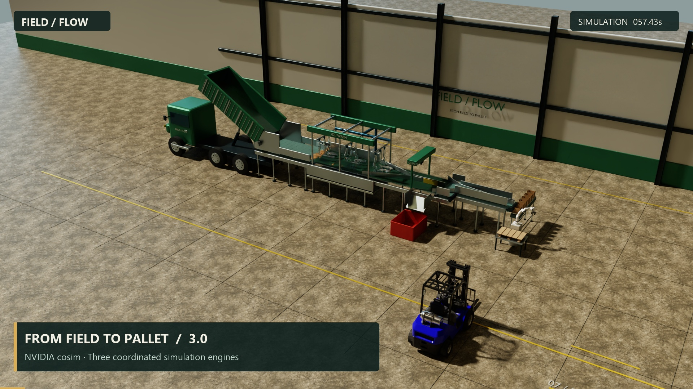

# FIELD / FLOW 3.0

A Blender-authored OpenUSD potato factory with NVIDIA cosim coordination, an ovphysx production line, an ovnewton Franka packing cell, native ovfmi control and ovrtx path tracing.

[Download the release](https://github.com/neelkm/potato-factory-cosim-v3/releases/tag/v3.0.0) · [Watch or download the film](https://github.com/neelkm/potato-factory-cosim-v3/releases/download/v3.0.0/potato_factory.mp4) · [Setup](docs/setup.md) · [Measured results](docs/validation.md)

Open **Launch Factory.cmd**. Select a station, seek through the measured run, play at different speeds, or drag and scroll to move the camera. **Play finished video** opens the 57-second station tour. The viewport traces each requested frame; the finished video plays smoothly at 24 fps.

The complete native batch, matching USD replay, desktop app and 57-second film passed release validation. Measured outcomes and file hashes are recorded in `output/VALIDATION.md` and `output/delivery_manifest.json`.

## What changed

Version 3 uses the original NVIDIA USD topology loader, coupling graph compiler, exchange plan and wavefront scheduler. Four authored cells express the real control sequence: sensors, controller, production line and packing cell. The line and packing cell advance concurrently after receiving fresh control data.

PhysX, Newton and FMI execute in three separate native worker processes. Each worker has a compatible Python environment; incompatible ovstage versions never share a process. The default transport uses shared host arrays for recorded body and water snapshots, with sequenced messages for commands and completion receipts.

Loaded cartons and the loaded pallet transfer as complete groups at a paused clock barrier. The transaction carries identity, membership, sealed joint frames, pose, COM velocity, angular velocity, mass, centre of mass and full inertia. Ownership commits after activation and independent state readback. A failed or ambiguous transaction stops the run.

NVIDIA's teleport, replica and explicit force-exchange APIs remain accessible for other boundaries. This factory keeps the close contacts between robot, cartons and pallet inside Newton. The advanced examples explain when the alternatives apply and what has actually been qualified.

## Factory stations

1. A slowly tipping truck unloads smaller, textured potatoes onto a receiving belt.
2. A driven roller section washes them with PhysX fluid particles and passes them through quality inspection.
3. The FMI controller rejects visibly damaged or insufficiently washed potatoes into the discard bin.
4. An output belt fills lightweight cardboard cartons with 15–20 good potatoes. Extended guides contain the queue through the belt exit, and the gate waits for the replacement carton to arrive. The terminal belt clears coasting produce before PhysX closes the lids.
5. Newton simulates the Franka FR3, four suction contacts, loaded cartons and pallet. The arm places six cartons.
6. The complete pallet and load return to PhysX. A SimReady forklift aligns its fork carriage with the measured pallet position, then lifts and delivers the load to dispatch through contact.

## Run options

| App option | Controls | Physics | Snapshot transport |
|---|---|---|---|
| Full simulation | Native FMI through ovfmi | PhysX line and fluid; Newton robot and packing | Shared host memory |
| Simple controls | Equivalent Python reference controller | Same native physics | Shared host memory |
| Diagnostic transport | Native FMI through ovfmi | Same native physics | Message payloads |

The selected option applies to the next run. It does not relabel or change the currently loaded replay. Each rerun gets a fresh cache and becomes available only after full validation. The simpler option reduces control dependencies; it is still a native physics simulation.

## Files

| File or folder | Purpose |
|---|---|
| `app.py`, `Launch Factory.cmd` | Desktop app with RTX viewport |
| `output/potato_factory.mp4` | Completed station film |
| `output/potato_factory.blend` | Editable geometry, materials, lights and packed textures |
| `output/factory.usda` | Simulatable USD source |
| `output/factory_physx.usda`, `factory_newton.usda`, `factory_fmi.usda` | Native engine views |
| `configs/factory_topology.usda` | NVIDIA cell, engine, port and coupling declarations |
| `output/factory_replay.usdc` | Replay entry point; keep companion layers and clips together |
| `output/cache` | Measured poses, water, events, ownership packets, USD clips and validation |
| `assets` | Franka FR3 and SimReady forklift assets |
| `src/framework` | Worker transport, graph execution and coupling APIs |
| `docs` | Architecture, alternatives, setup and checkpoint instructions |
| `contributions` | Prepared upstream opportunities, reproductions and a proposed skill |

## Setup and rebuild

This workstation has independent runtime copies in `.venv_coordinator`, `.venv_physx` and `.venv_newton`, and Blender in `tools`. Fresh installations follow [setup](docs/setup.md); private upstream access is required for the pinned NVIDIA development repositories and internal ovstage build. Native packages and asset archives are separate from Git source history.

**Run simulation.cmd** creates and validates a fresh run and opens its replay. The same operation is available in the app. **Render video.cmd** renders the delivered cache at 1080p, 24 fps and 16 samples per pixel with OptiX denoising, using three isolated render workers. Completed matching shots can be reused after interruption. `--workers 1` selects sequential rendering; `--spp 64` requests a slower higher-sample render.

Use the coordinator environment for `src/simulate_factory.py`, `examples/coupling_policies.py` and tests. Use the PhysX environment for stage authoring, FMI build, native validators, replay export and rendering. The Newton environment is selected automatically by the worker launcher.

## Physical scope

Potatoes, cartons and their contents are separate rigid bodies. Water is simulated as GPU particles; the visible liquid surface is reconstructed from those recorded particles. The robot uses motor torques, gravity compensation and manufacturer torque limits. Four geometric surface checks against the simulated lid poses establish the suction seal. Newton then integrates equal-reaction spring/damping forces with a per-cup force cap and seal travel limit.

Truck, belt and forklift actuators follow prescribed targets; contacts determine the resulting load motion. The forklift shell is a detailed SimReady asset attached to the simulated chassis and forks. Tyres and hydraulics are not separate vehicle subsystems. Closed cardboard lids become a sealed rigid assembly in Newton; PhysX retains its original lid constraints on return. Generic changing D6 joint topology is not supported by the factory transfer adapter.

Inspection uses the authored visible damage fraction and measured wash exposure. It is not a trained vision system. Cardboard deformation, vacuum leakage, soil-removal chemistry and arbitrary contact across the two engines are outside this demonstration.

## Checkpoint and contributions

On the original workstation, the previously delivered co-simulation edition is preserved in `../factory_checkpoints/master_20260915/`: 127,890 independent file copies, 94,656,297,849 bytes, individually SHA-256 verified. **Restore Factory master.cmd** in the parent workspace restores into a fresh folder. The original master app also remains in `../potato_factory_cosim/`. These local rollback copies are separate from the version 3 GitHub release.

Version 1's app and caches were retired. Its scene, assets, images and video are in `../factory_reference/v1/`. Version 2 remains available, including the shared geometry helper it still requires.

See [architecture](docs/architecture.md), [coupling options](docs/coupling_options.md), [asset provenance](docs/asset_provenance.md) and [contribution opportunities](contributions/README.md).
