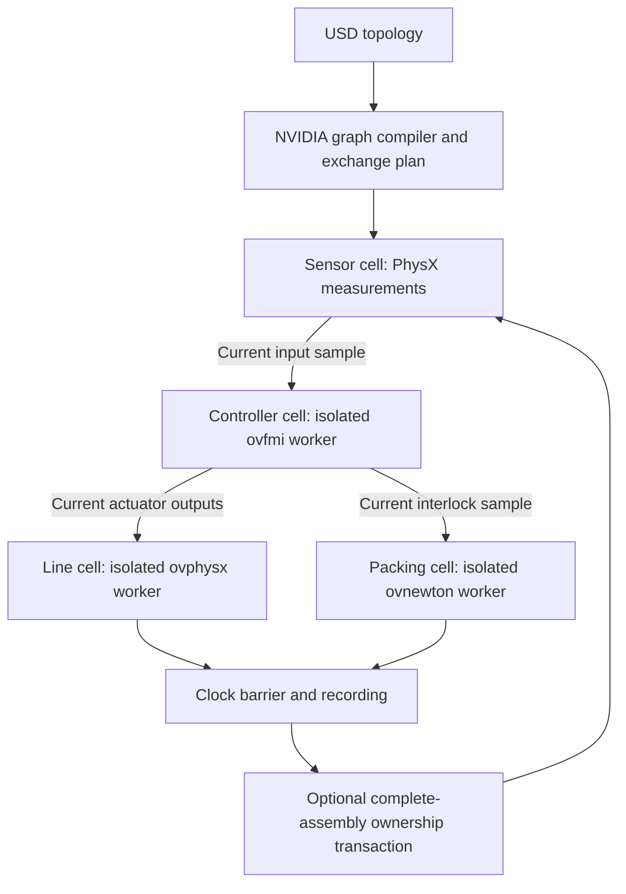

# Version 3 architecture

## Reuse boundary

The pinned NVIDIA cosim revision is `8b45d424641ebc74cbc5660a16aa7bc7eb4efeb3`. Its source is unchanged in the local `vendor/nvidia_cosim` directory. On a fresh checkout, the bootstrap script retrieves that exact revision with the user's existing GitHub access.

Production directly uses `load_topology`, `Simulation`, `compile_graph`, `ExchangePlan` and `WavefrontScheduler`. CPU `ScriptEngineInstance` cells are adapters to actual native workers. They do not approximate the physics in Python. `RpcExecutor` extends the upstream executor interface: it copies inbound Warp port buffers on the coordinator thread and dispatches only ordinary RPC callbacks concurrently. No Warp operation or native engine host call is dispatched concurrently within a process.

The FMI controller and PhysX sensing are separate cells, although the sensor and line callbacks share the same PhysX worker. The packing cell consumes the current interlock sample to establish dependency and freshness; the application-level robot cycle converts confirmed packing events into joint targets. Controller outputs do not directly specify robot joint torques.

## Rates and frames

| Contract | Value |
|---|---|
| Communication and recording | 30 Hz |
| PhysX integration | 240 Hz, eight substeps per communication interval |
| Newton robot integration | 960 Hz, 32 substeps per communication interval |
| Common integer clock | 240 Hz |
| Rigid pose | World body-origin position, metres; quaternion xyzw |
| Velocity | World COM linear velocity, m/s; world angular velocity, rad/s |
| Mass properties | kg, body-local COM in metres, full body-axis inertia about COM in kg·m² |
| Control ports | Nine declared values plus exact integer physics tick; `[1,10]` float32 |

Port layouts, units, coordinate frame and rates are checked before execution. The adapter rejects unsupported rate conversions rather than silently resampling. The pinned NVIDIA core supports additional scheduling patterns; this qualified factory contract deliberately declares one communication rate. Its maximum exact tick is below `2**24` because the control port carries its tick as float32.

The native ovfmi/FMPy runtime initializes its first call from USD start values, ignoring live mapped inputs on that call. Version 3 completes an idle initialization interval before plant tick zero. Both controller choices use that same initialization, with a documented FMU epoch offset of 1/30 second. The 600-sample native/reference comparison includes accept/reject decisions, dwell, valve response, target changes, busy interlocks and six-carton dispatch. Discrete outputs must match exactly; pressure allows native float32 precision.

The forklift derives docking position from the measured returned pallet. Packing can shift the pallet on its table: one qualification load moved approximately 62 mm, enough for nominally positioned forks to strike a pallet block. A side-shifting fork carriage aligns with the measured pallet before approach. The adapter checks its 150 mm travel limit, pallet orientation and loading-table height. Chassis motion still follows its heading; the load moves through contact. A native regression compares the old nominal docking and measured alignment using the same saved 139-body return packet.

The terminal conveyor has its own clearing control. Once the upstream fill gate holds the queue, the final belt continues at its normal speed for 0.8 seconds after the carton reaches its target. It then decelerates at 1.08 m/s². This prevents late potatoes from stopping at the belt lip and falling against an upright carton flap. Native positive and negative fixtures use the same recorded belt-exit poses and estimated velocities: the original stop loses one potato, while the clearing control retains all 20. The fixture is not a restored solver checkpoint, and complete batch validation remains required.

The filling guides continue to x = 7.78 m, containing the queue through the belt lip while clearing the robot's pickup. An independent carton-ready interlock keeps the gate raised during replacement-carton travel. Native positive and negative queue-release fixtures isolate the guide change: the shorter guide loses one of five potatoes; the extended guide retains all five. A separate loaded Newton robot cycle checks pickup and placement beside the extended guide. Full-run validation independently checks measured gate positions during all five carton changes.

## Process and transport contracts

Three authenticated local workers isolate native dependency versions. Each request has a protocol version, monotonically increasing request ID and expected native tick. Responses identify the request and report the runtime tick. A timeout or mismatched receipt latches that connection as failed; a late result cannot silently satisfy a later request. The coordinator also latches any failed simulation barrier. A new run is required after failure.

Commands and state-transfer packets use RPC. In the default profile, capture data uses fixed shared host arrays with stable body ordering and capacity. Workers finish all writes before returning a completion receipt. The parent consumes those arrays before allowing another capture to overwrite them. This removes large array serialization from the capture messages. It is not GPU zero-copy: native tensor readback and recording still move data through host memory.

Metrics record RPC counts and elapsed times, cell times and total run time. Parallel cell timings overlap and must not be summed as total wall time. Any comparison to the master is an observed workload comparison, not a controlled speed benchmark: the new startup timing can alter contact outcomes and carton distributions.

## Assembly transactions

1. Export the entire sender-owned group while both engines are paused.
2. Validate finite states, positive mass/inertia, identities, membership and joint frames; hash the versioned packet.
3. Freeze all sender bodies and verify native inactive state.
4. Import body properties and supported sealed-joint frames into the inactive receiver.
5. Activate the receiver and read back native states.
6. Check continuity, commit owner identities and record both packet and echo.

The return packet contains the pallet and all cartons, lids and contained potatoes. The solver owning that group resolves all its close contacts. PhysX's mass-property tensor is already in body axes; rotating it by the native principal-axis COM quaternion again would corrupt it. The importer writes COM position before the full inertia tensor and restores velocity after reactivation, because disabled PhysX actors do not accept a live velocity write.

After a carton transfers to Newton, the PhysX line stops issuing lid-drive commands to its inactive counterparts. Their final closed targets remain available for return without repeatedly waking disabled actors.

If preparation fails, rollback first verifies that the receiver is inactive, then restores and activates the sender. If that cannot be established, the transaction remains marked ambiguous and neither scheduler continues. Even a successful rollback leaves the run halted. These are runtime failure semantics, not a claim that an arbitrary distributed engine can undo external side effects.

Newton rebuilds collision eligibility at ownership barriers because changing shape flags alone did not update the cached broad phase in the qualified SDK. Joint transfer is intentionally limited to the authored factory's sealed carton contract. The original PhysX lid constraints stay in its paused scene; generic joint insertion, changed joint topology and a full serialized solver state are not supported.

Suction is a custom Newton force model. The seal detector intersects four cup rays with the collision panels of the measured lid poses, checking distance and surface normal. It does not query Newton's contact manifold. Once sealed, equal and opposite point forces act on the tool and carton, with damping, per-cup saturation and a 30 mm travel limit. This distinction makes the attachment model and its limits explicit for a future backend adapter.

## Alternatives and qualification

`framework/coupling.py` preserves NVIDIA handoff, replica-routing and directed coupling APIs. `NvidiaTeleportBridge` uses the actual NVIDIA zone policy to decide contact-free crossings, then applies complete-state native transactions. Its moving-body fixture includes rotation, off-centre COM, anisotropic inertia, immediate momentum continuity and a first-step ballistic COM check in each receiver.

The full factory uses assembly transfer. Replica and proxy-force policies are exercised as policy/port examples; their native cross-engine contact dynamics are not qualified by that example. They require appropriate native proxy and wrench adapters and their own contact scenes. Capability declarations for this factory do not claim those features.

Qualification is layered: failure and contract tests; the original NVIDIA core tests; real FMU equivalence; native 23-body loaded-carton roundtrip; native moving boundary; complete batch outcome checks; value-clip boundary checks; asset resolution; desktop navigation and replay reload; visual review; and full video decoding. Only the complete batch and its matching replay may produce the release movie.

The file checkpoint restores a known project and its artifacts. It does not resume the exact middle of a physics step or serialize hidden FMU state.

## Render execution

Independent station shots render in three isolated RTX processes by default; `--workers 1` retains the sequential path. Each process owns its own ovstage and renderer. Three-worker image consistency is qualified separately on the read-only master fixture; the released video uses only the new validated factory cache.

Each shot is encoded once, checked for frame count, resolution and rate, then assembled by lossless stream concatenation. A complete shot can be reused after interruption only when its file hash, simulation, scene, shot description, renderer source and settings still match. The final video is decoded in full before publication. The progress-file writer retries transient Windows sharing violations; advisory progress updates cannot abort healthy physics or rendering when a reader briefly holds the target file.

## Upstream source references

- [NVIDIA cosim](https://github.com/NVIDIA-dev/cosim/tree/8b45d424641ebc74cbc5660a16aa7bc7eb4efeb3): `cosim/usd_loader.py`, `core/sim.py`, `core/graph.py`, `core/exchange.py`, `core/scheduler.py`, `core/handoff.py`, `core/partition.py`.
- [ovnewton internal](https://github.com/NVIDIA-Omniverse/ovnewton-internal/tree/fe5dcfe9e017e2e462ede0ab7dea73120dd0b46d): USD/Newton adapter and matching ovstage requirement.
- [ovfmi source](https://github.com/NVIDIA-Omniverse/omniverse-labs/tree/da9ce230ccaf464aca6a5246ac3ace1c925c4eeb/projects/ovfmi): native FMU hosting and FMPy startup behavior.

These repositories may require the reader's NVIDIA access. The implementation comparison is also preserved in `docs/prior_comparison.md` for context.
