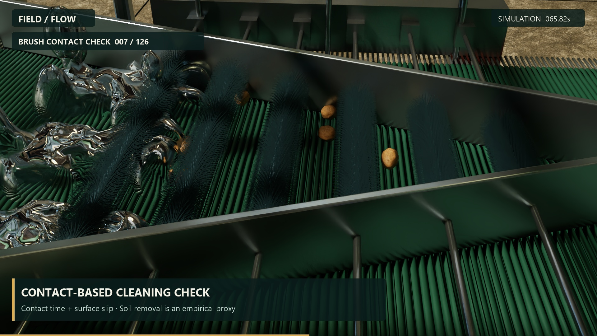

# Post-wash brush scrubbing

[Measured qualification results](scrub_validation.md)

The additive factory variant inserts six driven soft-brush rollers immediately
after the water wash and before the inspection station. The existing lower
conveyor carries the potatoes beneath the brushes. Different brush speeds create
relative surface movement without using brushes as the only means of transport.

## Reference and scope

The [user-supplied Reddit factory reference](https://www.reddit.com/r/Taizyfoodmachinery/comments/qhcog5/complete_potato_washing_line_plant_peeling/)
describes a multi-station processing line. The [Taizy manufacturer description](https://taizyfoodmachinery.com/potato-washing-and-peeling-machine/)
informed the stainless housing, nylon brushes, catch screen, drainage tray and
service hardware. This is a gentle dirt-scrubbing module, not a peeling machine.
The [linked YouTube video](https://www.youtube.com/watch?v=lh2Q4dF1l9M) was not
accessible during implementation; its frames were not used or claimed as viewed.

The editable Blender variant includes station labels and bevelled sheet-metal
parts. The runtime USD variant uses lightweight procedural geometry and thousands
of visible nylon tufts grouped into six meshes. The original truck, belts, washing
fluid, SimReady forklift, Franka robot and packing workflow remain in the scene.

## Physics and cleaning signal

Each brush is a 0.35 kg PhysX rigid rotor with a Y-axis revolute drive. Its collision
surface is a compliant cylinder of 60 mm radius; individual bristles are visual
geometry, not thousands of separately simulated flexible bodies. Native compliant
contact stiffness is 120 N/m, damping 0.8, and drive torque is limited to 0.6 Nm.
Brush speed follows the conveyor's run/stop command. Guides and drive supports use
the existing conveyor collision filtering; potato/brush contacts remain active.

After every 240 Hz PhysX step, contact sensors read loaded potato/brush contacts.
The cleaning proxy accumulates contact duration once per potato per step and
mean tangential relative contact-point speed times the step duration. Velocities
include each rigid body's angular velocity and the potato's centre-of-mass offset.
A potato is scrubbed after at least 0.6 seconds of loaded contact and 25 mm of
cumulative tangential slip. These are empirical qualification thresholds, not
experimentally calibrated dirt-removal predictions. Loose soil grains, dirty water
chemistry, bristle elasticity and measured sanitation effectiveness are outside
this model. The catch tray and drain are presentation geometry.

FMI's existing `washed` readiness input now means **washed and scrubbed** for this
variant. Visible damage rejection is unchanged. Carton/contents handoff and Franka
motion remain in Newton; the loaded pallet returns to PhysX for the forklift.

## Files and reproduction

- `src/author_scrub_station.py`: additive USD geometry, contact material and drives.
- `src/scrub_station.py`: native contact measurements and cleaning proxy.
- `src/check_scrub_station.py`: isolated 12-potato native qualification.
- `src/simulate_factory.py --physx-source factory_physx_scrub.usda --cache scrub_20261005 --seconds 1200`: full production run.
- `src/validate_run.py --cache scrub_20261005`: original end-to-end checks plus
  brush rotation, measured cleaning thresholds, and wash/scrub/inspection ordering.
- `src/bake_replay.py --cache scrub_20261005 --name factory_scrub_replay.usdc`:
  measured rigid-body and fluid replay.
- `src/render_scrub_video.py`: separate 30-second captioned RTX station tour.
- `scripts/build_scrub_blender.py`: editable `output/potato_factory_scrub.blend`
  and USD station signage. Run `src/scrub_presentation.py` after this export to
  include the signage layer in the runtime scene. Its light and support geometry
  are presentation-only additions.

Use the coordinator Python environment for simulation, the PhysX Python environment
for USD/RTX/probe commands, and the bundled Blender executable for the Blender script.
Do not run two native PhysX simulations simultaneously. RTX replay and CPU water
reconstruction can be prepared independently of the live physics process.
The scrubber film defaults to one RTX worker and an eight-thread USD work pool;
this avoids the scene-loading contention observed with multiple large native
thread pools. `PXR_WORK_THREAD_LIMIT` and `--workers` remain overridable.

The full native run writes contact totals, per-potato contact duration/slip,
scrub-completion times, decisions, transfers and production outcomes in
`output/scrub_20261005/simulation.json`. Native-run and replay validations are
separate artifacts in the same directory. The isolated probe's validation is
`output/scrub_probe_validation.json`; it does not substitute for the full batch.

## Preservation and app selection

Before implementation, source (including the physics debugger) was archived to
`../factory_checkpoints/pre_scrubber_20261005/source.zip`. Its adjacent checkpoint
manifest records original scene/asset hashes. The original USD, Blender file,
simulation cache, replay and movie remain under their existing names.

`output/active_run.json` selects the default app replay only after validation.
`Launch Factory Original.cmd` explicitly opens the original scene and cache.
The existing physics debugger displays its original, separately captured diagnostic
recording; the app labels that distinction when the scrubber variant is loaded.
