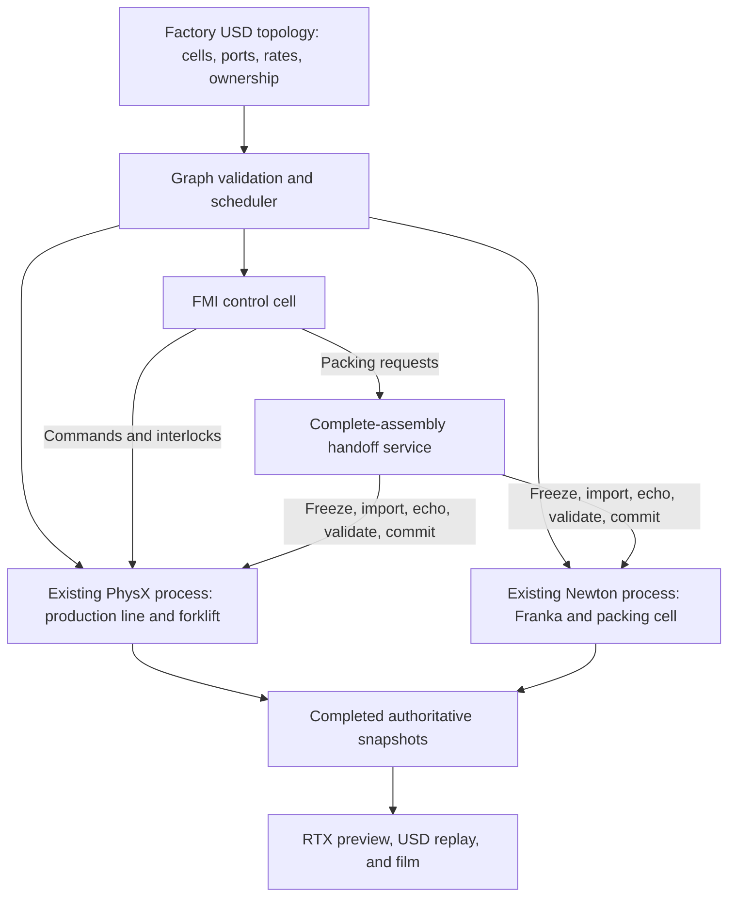

# Co-simulation architecture comparison

**Recommendation: adopt the reusable cell, port, scheduling, and transport architecture from NVIDIA-dev/cosim incrementally, while retaining the factory's complete-assembly handoff protocol.** The repository is a useful foundation for a larger factory application. Its existing conveyor handoff is not a direct replacement for transferring filled cartons with lids and loose contents.

The comparison uses private repository revision `42de2ec4717591607ccb3555e7b6b71345989fe5`, committed September 14, 2026 at 23:58:41 UTC, and the delivered `potato_factory_cosim` application. The repository was inspected on September 15. A pinned source snapshot and focused CPU contract-probe results accompany this report. Native GPU examples were not rerun, and repository benchmark results below are explicitly attributed to its authors. The factory application, environments, assets, video, and previous-version checkpoint were not modified. [1](https://github.com/NVIDIA-dev/cosim/tree/42de2ec4717591607ccb3555e7b6b71345989fe5), [2](C:/Users/neelakantanm/AIClaude/Codex/research/cosim_comparison_20260915/contract_probe_results.json), [3](C:/Users/neelakantanm/AIClaude/Codex/potato_factory_cosim/output/VALIDATION.md)

**The two systems solve overlapping problems at different levels of generality.** The factory is a working application with two physics workers and a native FMI controller embedded in the line worker. Its transfers occur at a few carefully selected production events. The repository separates reusable simulation cells, engine adapters, typed ports, coupling edges, execution policies, and rendering. It also includes a separate multiprocess partitioning implementation for large conveyors. These are related implementations, not one interchangeable API covering every feature in its design documents. [4](C:/Users/neelakantanm/AIClaude/Codex/potato_factory_cosim/src/coordinator.py:9), [5](C:/Users/neelakantanm/AIClaude/Codex/potato_factory_cosim/src/state_protocol.py:1), [6](https://github.com/NVIDIA-dev/cosim/blob/42de2ec4717591607ccb3555e7b6b71345989fe5/cosim/core/engine.py#L24)

| Concern | Delivered factory | NVIDIA-dev/cosim | Implication |
| --- | --- | --- | --- |
| Scene description | Shared factory USD with PhysX/Newton overlays and factory-specific ownership attributes | USD topology declares cells, engine instances, ports, couplings, and handoff zones; cells load their own scene assets | Adopt a declarative topology around existing assets |
| Engine contract | Application-specific RPC methods such as `advance`, `capture`, `seal_carton`, and `transfer_request` | Common `attach`, `validate`, `apply_inputs`, `step`, and `publish_outputs` interface | Easier to add stations and engines through adapters |
| Scheduling | Two independent workers advance concurrently, then meet at a barrier | Dependency-ordered serial or wavefront scheduling; separate multiprocess barriers | Add explicit dependencies before introducing continuous force exchange |
| Clock | Integer 240 Hz clock; workers advance eight ticks per 30 Hz control interval; Newton integrates at 960 Hz | Base exchange clock with engine substeps; slower independent rates are not fully implemented | Preserve actual control cadence during migration |
| State transport | Authenticated local RPC serializes Python/NumPy payloads; recorded output uses memory-mapped files | Persistent Warp buffers in process; shared float32 arrays and small tick receipts between processes | Improve recurring snapshot transport after profiling |
| Ownership | Whole carton or loaded pallet transferred transactionally | Per-body zone policy; separate pooled partition router | Keep assembly membership and joint semantics as an extension |
| Handoff payload | Pose, COM velocity, angular velocity, mass, local COM, full inertia, membership, lid-joint frames | Pose and velocity in 13 floats plus command; partition records also carry object/template identity | Existing factory packet is richer |
| Contact across engines | Interacting robot/carton/pallet stay together in Newton; entire load returns to PhysX | Kinematic proxies, explicit force exchange, and approximate replica seams | Useful for future shared interactions, unnecessary for current pickups |
| FMI | One actual FMU handles inspection, valve response, packing and dispatch interlocks | Generic FMI/SSP engine exposes mapped variables through ports | Reuse the FMU and improve its integration boundary |
| Rendering | Validated recorded dynamics, USD replay, RTX station film, desktop replay viewer | Live authoritative engine snapshots, RTX, optional CUDA/OpenGL presentation | Add live preview separately from the archival replay |
| Scale | Fixed factory, 505 recorded rigid bodies and 2,592 fluid particles | Bounded model partitions, compatible actor pools, multiple devices, resource budgets | Relevant when expanding to many lines; not an automatic speedup today |
| Recovery | Verified application/asset checkpoint; transfer preparation can roll back before stepping | Worker group fails closed; primitive model cache accelerates initialization | Neither provides a general resumable whole-simulation checkpoint |

Sources for the comparison: factory implementation and delivery records [3](C:/Users/neelakantanm/AIClaude/Codex/potato_factory_cosim/output/VALIDATION.md), [4](C:/Users/neelakantanm/AIClaude/Codex/potato_factory_cosim/src/coordinator.py:9), [5](C:/Users/neelakantanm/AIClaude/Codex/potato_factory_cosim/src/state_protocol.py:1), [7](C:/Users/neelakantanm/AIClaude/Codex/potato_factory_cosim/src/physx_engine.py:27), [8](C:/Users/neelakantanm/AIClaude/Codex/potato_factory_cosim/src/newton_engine.py:37), [9](C:/Users/neelakantanm/AIClaude/Codex/potato_factory_cosim/src/fmi_control.py:1), [10](C:/Users/neelakantanm/AIClaude/Codex/potato_factory_cosim/src/simulate_factory.py:49); repository core, adapters, partitions, and rendering [6](https://github.com/NVIDIA-dev/cosim/blob/42de2ec4717591607ccb3555e7b6b71345989fe5/cosim/core/engine.py#L24), [11](https://github.com/NVIDIA-dev/cosim/blob/42de2ec4717591607ccb3555e7b6b71345989fe5/cosim/core/handoff.py#L154), [12](https://github.com/NVIDIA-dev/cosim/blob/42de2ec4717591607ccb3555e7b6b71345989fe5/cosim/core/partition.py#L67), [13](https://github.com/NVIDIA-dev/cosim/blob/42de2ec4717591607ccb3555e7b6b71345989fe5/cosim/core/process.py#L1), [14](https://github.com/NVIDIA-dev/cosim/blob/42de2ec4717591607ccb3555e7b6b71345989fe5/cosim/engines/newton.py#L353), [15](https://github.com/NVIDIA-dev/cosim/blob/42de2ec4717591607ccb3555e7b6b71345989fe5/cosim/engines/fmi.py#L1), [16](https://github.com/NVIDIA-dev/cosim/blob/42de2ec4717591607ccb3555e7b6b71345989fe5/cosim/core/scheduler.py#L119), [17](https://github.com/NVIDIA-dev/cosim/blob/42de2ec4717591607ccb3555e7b6b71345989fe5/cosim/core/coupling.py#L13), [18](https://github.com/NVIDIA-dev/cosim/blob/42de2ec4717591607ccb3555e7b6b71345989fe5/docs/reports/workload-distribution.md#L1086), [19](https://github.com/NVIDIA-dev/cosim/blob/42de2ec4717591607ccb3555e7b6b71345989fe5/cosim/core/exchange.py#L1).

**1. The shared architectural principles are sound.** Both systems isolate engine-specific state behind adapters, identify scene objects through USD paths, explicitly assign an authoritative owner, and publish a separate visual view. Both use fixed simulation-time steps rather than the movie's playback speed to drive physics. Both pre-create receiving representations instead of trying to move a native PhysX actor pointer into Newton. A handoff maps portable state into an already compatible representation; it does not transfer the native solver object. [4](C:/Users/neelakantanm/AIClaude/Codex/potato_factory_cosim/src/coordinator.py:9), [5](C:/Users/neelakantanm/AIClaude/Codex/potato_factory_cosim/src/state_protocol.py:1), [6](https://github.com/NVIDIA-dev/cosim/blob/42de2ec4717591607ccb3555e7b6b71345989fe5/cosim/core/engine.py#L24), [11](https://github.com/NVIDIA-dev/cosim/blob/42de2ec4717591607ccb3555e7b6b71345989fe5/cosim/core/handoff.py#L154)

Both implementations address the same subtle engine constraints. PhysX must be re-enabled before velocity writes take effect. Newton needs more than a kinematic flag to prevent a retired representation from colliding. The factory disables its shapes and related joints, updates inverse mass/inertia, rebuilds the collision pipeline at the paused transfer, and recaptures its GPU graph. The repository parks retired Newton bodies away from the scene and refreshes solver body properties, avoiding a broad-phase rebuild for routine conveyor transfers. The latter is a useful optimization pattern, but importing it into the factory requires preserving carton joints and the measured mass properties. [7](C:/Users/neelakantanm/AIClaude/Codex/potato_factory_cosim/src/physx_engine.py:27), [8](C:/Users/neelakantanm/AIClaude/Codex/potato_factory_cosim/src/newton_engine.py:37), [14](https://github.com/NVIDIA-dev/cosim/blob/42de2ec4717591607ccb3555e7b6b71345989fe5/cosim/engines/newton.py#L353)

The role of FMI also needs precision: in both examples it hosts controller or plant variables. It does not receive the potatoes as a third rigid-body dynamics world. The current factory genuinely executes its inspection/control FMU through ovfmi; the opportunity is to make that controller a first-class cell. [9](C:/Users/neelakantanm/AIClaude/Codex/potato_factory_cosim/src/fmi_control.py:1), [15](https://github.com/NVIDIA-dev/cosim/blob/42de2ec4717591607ccb3555e7b6b71345989fe5/cosim/engines/fmi.py#L1)

**2. There are three different handoff mechanisms to distinguish.**

The factory's coordinator first validates the complete group and snapshots the sender. It freezes the sender, imports into an inactive receiver, activates the receiver without advancing either engine, reads back the receiver, and checks continuity. Only then does it change the ownership ledger. If preparation fails, it attempts to disable the receiver and restore the sender. If the receiver cannot acknowledge that it is disabled, the sender remains off and the run halts. This is a paused ownership transaction, not fault-tolerant distributed consensus. [4](C:/Users/neelakantanm/AIClaude/Codex/potato_factory_cosim/src/coordinator.py:9)

The production carton contains 23 independently represented bodies: one carton, four lids, and 18 potatoes. Six cartons plus the pallet form the final 139-body return transfer. The packet preserves each body's full mass properties and explicitly records assembly membership and sealed-lid frames. The receiving Newton stage already contains the required joints; those frames are updated from measured geometry. The returning PhysX stage retains its authored closure constraints. This is a specialized sealed-carton contract, not an arbitrary articulation migration facility. [5](C:/Users/neelakantanm/AIClaude/Codex/potato_factory_cosim/src/state_protocol.py:1), [7](C:/Users/neelakantanm/AIClaude/Codex/potato_factory_cosim/src/physx_engine.py:27), [8](C:/Users/neelakantanm/AIClaude/Codex/potato_factory_cosim/src/newton_engine.py:37), [10](C:/Users/neelakantanm/AIClaude/Codex/potato_factory_cosim/src/simulate_factory.py:49)

The repository's `HandoffPolicy` instead evaluates oriented, finite conveyor boundaries and issues per-body ACTIVE, PROXY, RETIRE, or ACTIVATE_TELEPORT commands. In force mode, PhysX owns the straddling object because the adapter cannot harvest proxy forces; Newton computes the neighboring contact contribution. On takeover from a force-capable cell, the departing copy deliberately stays ACTIVE for one tick before becoming a proxy or retiring. The ledger still has one authoritative owner, but two engine copies integrate during that tick. The local probe reproduced commands `[ACTIVE, ACTIVATE_TELEPORT]`, followed by `[PROXY, ACTIVE]`. This is an intentional conveyor technique and differs from our strict physical deactivation-before-activation rule. [2](C:/Users/neelakantanm/AIClaude/Codex/research/cosim_comparison_20260915/contract_probe_results.json), [11](https://github.com/NVIDIA-dev/cosim/blob/42de2ec4717591607ccb3555e7b6b71345989fe5/cosim/core/handoff.py#L154)

The newer multiprocess `ReplicaRouter` has different behavior. It promotes the receiving slot and demotes the outgoing slot at the same barrier; it does not use that ACTIVE overlap rule. In replica mode the outgoing slot becomes a dynamic proxy; in teleport mode it retires. Its fixed worker set, tick receipts, and compatible slot pools support efficient bulk transfers. However, it does not implement our receiver mass-property echo, assembly-wide joint transaction, or preparation rollback. The local probe separately confirmed the source-PROXY/destination-ACTIVE transition. [2](C:/Users/neelakantanm/AIClaude/Codex/research/cosim_comparison_20260915/contract_probe_results.json), [12](https://github.com/NVIDIA-dev/cosim/blob/42de2ec4717591607ccb3555e7b6b71345989fe5/cosim/core/partition.py#L67), [13](https://github.com/NVIDIA-dev/cosim/blob/42de2ec4717591607ccb3555e7b6b71345989fe5/cosim/core/process.py#L1)

In repository terminology, “teleport” means setting the receiver to the sender's pose and velocity. It does not necessarily imply a visible spatial jump. Conversely, transferring a matching pose does not establish matching dynamics: mass, inertia, contact settings, constraint state, and the first post-transfer steps matter too.

**3. Continuous coupling is the repository's largest functional addition.** Its implemented coupling enum contains observation, signal exchange, kinematic boundary, and explicit force exchange. The graph enforces one writer per input, validates directions and quantities, rejects unresolved ports, and derives execution order. Observation edges deliberately do not impose an ordering dependency, allowing feedback to use previously published observations. Ordered force consumers must receive the producer's current-tick output. [16](https://github.com/NVIDIA-dev/cosim/blob/42de2ec4717591607ccb3555e7b6b71345989fe5/cosim/core/scheduler.py#L119), [17](https://github.com/NVIDIA-dev/cosim/blob/42de2ec4717591607ccb3555e7b6b71345989fe5/cosim/core/coupling.py#L13)

For example, the Newton cloth-catch example lets PhysX retain ownership of a box while a Newton proxy interacts with cloth. Newton estimates a wrench from the proxy's momentum change over the integration interval, subtracts gravity, and supplies that contact contribution to PhysX. The scheduler orders this feedback in the same tick. Replica seams are different: each engine solves against a previous-tick proxy and keeps its own body's result. They approximate cross-boundary contact; they are not one converged contact solve. [14](https://github.com/NVIDIA-dev/cosim/blob/42de2ec4717591607ccb3555e7b6b71345989fe5/cosim/engines/newton.py#L353), [18](https://github.com/NVIDIA-dev/cosim/blob/42de2ec4717591607ccb3555e7b6b71345989fe5/docs/reports/workload-distribution.md#L1086)

This distinction matters for the factory. Keeping the Franka, held carton, contents, and pallet in Newton is currently a good choice because suction, settling, and stacking are tightly coupled. There is no need to introduce a 30 Hz cross-engine spring into a contact system already integrated together at 960 Hz. Proxy coupling becomes useful if a robot must pick a moving carton while a PhysX conveyor continues supporting it, or if a loaded pallet must interact simultaneously with Newton and PhysX equipment.

The repository's design proposal describes dynamic suction/D6 connectors and a Newton/FMI forklift querying a PhysX environment. Those are useful design directions, but there is no generic dynamic-D6 coupling mode in the inspected executable coupling enum, nor a ready-made Franka box-packing implementation. Its rigid/cloth proxy example demonstrates part of the required mechanics, not the entire proposed connector lifecycle. [17](https://github.com/NVIDIA-dev/cosim/blob/42de2ec4717591607ccb3555e7b6b71345989fe5/cosim/core/coupling.py#L13), [20](https://github.com/NVIDIA-dev/cosim/blob/42de2ec4717591607ccb3555e7b6b71345989fe5/docs/design/proposal.md#L794)

There is also published evidence against assuming all seams are robust. The repository's report records a 5,400-tick default force-seam pileup run with nine fallen boxes, fourteen popped boxes, and 76 overlap ticks. It explicitly distinguishes this failed stress case from six passing examples. The later dependency audit did not rerun pileup, so the exact latest dependency combination's behavior in that case remains unverified. This is a reason to retain the factory's contact-group transfers and test any new seam under congestion. [18](https://github.com/NVIDIA-dev/cosim/blob/42de2ec4717591607ccb3555e7b6b71345989fe5/docs/reports/workload-distribution.md#L1086), [21](https://github.com/NVIDIA-dev/cosim/blob/42de2ec4717591607ccb3555e7b6b71345989fe5/docs/design/dependencies.md#L1)

**4. Scheduling is more reusable, but migration must preserve actual rates.** Our master clock is expressed in 240 Hz ticks, yet the main loop advances workers by eight ticks at a time. Thus the current interprocess barrier, control update, and recording rate is 30 Hz, not 240 exchanges per second. PhysX makes eight physics steps in each interval; Newton makes 32 internal steps. Because the worlds exchange no continuous mechanical force during these intervals, concurrent advancement is appropriate. [4](C:/Users/neelakantanm/AIClaude/Codex/potato_factory_cosim/src/coordinator.py:9), [8](C:/Users/neelakantanm/AIClaude/Codex/potato_factory_cosim/src/newton_engine.py:37), [10](C:/Users/neelakantanm/AIClaude/Codex/potato_factory_cosim/src/simulate_factory.py:49)

The repository separates the scheduler, which decides which cells may run together, from the executor, which performs the work. Its wavefront scheduler keeps dependency-connected cells in different batches. Its asynchronous in-process executor enqueues Newton work on one host thread before a blocking PhysX operation; it does not concurrently call Warp from multiple Python threads. Our threads dispatch work to independent processes, so the two designs do not conflict on that point. [16](https://github.com/NVIDIA-dev/cosim/blob/42de2ec4717591607ccb3555e7b6b71345989fe5/cosim/core/scheduler.py#L119)

The rate implementation has limits. It computes `max(1, ceil(engine_rate/base_rate))`, so a requested 30 Hz cell under a 240 Hz base still executes once every base tick. A requested 1,000 Hz engine becomes 1,200 calls per simulated second at that base. Port and coupling rate fields do not currently drive separate exchange schedules in the inspected core. A CPU probe confirmed the substep counts. [2](C:/Users/neelakantanm/AIClaude/Codex/research/cosim_comparison_20260915/contract_probe_results.json), [16](https://github.com/NVIDIA-dev/cosim/blob/42de2ec4717591607ccb3555e7b6b71345989fe5/cosim/core/scheduler.py#L119)

A first migration can preserve the existing 30 Hz exchange base: PhysX at 240 Hz with eight calls per base interval; Newton at 240 Hz with four native substeps per call, producing 960 Hz; FMI at 30 Hz. Alternatively, Newton could use 960 Hz with one internal substep. These are adapter-design targets requiring validation, not a configuration that can be pasted over the present application-specific `advance` methods. If faster cross-engine force exchange is later required, implement explicit controller decimation and timestamps before increasing the base rate. [8](C:/Users/neelakantanm/AIClaude/Codex/potato_factory_cosim/src/newton_engine.py:37), [10](C:/Users/neelakantanm/AIClaude/Codex/potato_factory_cosim/src/simulate_factory.py:49), [14](https://github.com/NVIDIA-dev/cosim/blob/42de2ec4717591607ccb3555e7b6b71345989fe5/cosim/engines/newton.py#L353), [16](https://github.com/NVIDIA-dev/cosim/blob/42de2ec4717591607ccb3555e7b6b71345989fe5/cosim/core/scheduler.py#L119)

Frame checking also needs strengthening. The repository stores a port's frame, but graph compilation accepts a world-frame output wired directly to a tool-frame input. Exchange copies matching arrays without transforming coordinates. Our canonical handoff already specifies metres, kilograms, seconds, body-origin pose, world COM velocity, radians per second, and body-frame inertia. A reusable integration should preserve those conventions and validate frame, units, layout version, sample tick, and signal freshness. [2](C:/Users/neelakantanm/AIClaude/Codex/research/cosim_comparison_20260915/contract_probe_results.json), [5](C:/Users/neelakantanm/AIClaude/Codex/potato_factory_cosim/src/state_protocol.py:1), [16](https://github.com/NVIDIA-dev/cosim/blob/42de2ec4717591607ccb3555e7b6b71345989fe5/cosim/core/scheduler.py#L119), [17](https://github.com/NVIDIA-dev/cosim/blob/42de2ec4717591607ccb3555e7b6b71345989fe5/cosim/core/coupling.py#L13)

**5. Transport and profiling offer practical performance improvements.** The factory sends complete pose/water snapshots through local RPC for every recorded frame and performs several smaller status calls. It uses fixed memory-mapped output arrays, but those are recording storage, not the shared-memory IPC transport used by the repository. The repository's in-process exchange plan reuses packed buffers; its process framework sends arrays through shared memory while sockets carry only control messages and completion receipts. At scale, the partition worker publishes boundary rows and cheap telemetry every tick and full snapshots only when requested. [10](C:/Users/neelakantanm/AIClaude/Codex/potato_factory_cosim/src/simulate_factory.py:49), [12](https://github.com/NVIDIA-dev/cosim/blob/42de2ec4717591607ccb3555e7b6b71345989fe5/cosim/core/partition.py#L67), [13](https://github.com/NVIDIA-dev/cosim/blob/42de2ec4717591607ccb3555e7b6b71345989fe5/cosim/core/process.py#L1), [19](https://github.com/NVIDIA-dev/cosim/blob/42de2ec4717591607ccb3555e7b6b71345989fe5/cosim/core/exchange.py#L1)

The strongest immediate borrowing is persistent buffers for poses and water, combined status receipts, and separate timings for native stepping, control, transfers, readback, serialization, and recording. CPU shared memory still requires GPU-to-host staging; it is not GPU zero-copy. Nor is the whole repository host-free: the zone policy uses NumPy, FMI uses CPU buffers, and the PhysX wrench adapter reads selected data on the host. [11](https://github.com/NVIDIA-dev/cosim/blob/42de2ec4717591607ccb3555e7b6b71345989fe5/cosim/core/handoff.py#L154), [13](https://github.com/NVIDIA-dev/cosim/blob/42de2ec4717591607ccb3555e7b6b71345989fe5/cosim/core/process.py#L1), [14](https://github.com/NVIDIA-dev/cosim/blob/42de2ec4717591607ccb3555e7b6b71345989fe5/cosim/engines/newton.py#L353), [15](https://github.com/NVIDIA-dev/cosim/blob/42de2ec4717591607ccb3555e7b6b71345989fe5/cosim/engines/fmi.py#L1), [19](https://github.com/NVIDIA-dev/cosim/blob/42de2ec4717591607ccb3555e7b6b71345989fe5/cosim/core/exchange.py#L1)

The delivered run recorded 561.93 simulated seconds in 3,857.89 wall seconds, about 0.146 times real time. That total includes initialization, validation/recording work, and shutdown; it is not an isolated solver benchmark. Seven infrequent handoff packets are unlikely to be the primary throughput target. The repository's multi-GPU conveyor timings are not comparable to an A6000 running water, a torque-controlled articulated robot, and detailed geometry. Measure this factory before claiming a speedup or reducing substeps. [3](C:/Users/neelakantanm/AIClaude/Codex/potato_factory_cosim/output/VALIDATION.md), [10](C:/Users/neelakantanm/AIClaude/Codex/potato_factory_cosim/src/simulate_factory.py:49), [18](https://github.com/NVIDIA-dev/cosim/blob/42de2ec4717591607ccb3555e7b6b71345989fe5/docs/reports/workload-distribution.md#L1086)

Its actor pools become attractive for many lines and thousands of recurring objects. They retain shape and mass per template and recycle compatible slots rather than duplicate every logical body into every cell. The factory would need templates covering potato collision geometry/mass and carton components, plus assembly reservations. For today's six cartons, that complexity has lower priority than reducing recurring readbacks and improving failure handling. [12](https://github.com/NVIDIA-dev/cosim/blob/42de2ec4717591607ccb3555e7b6b71345989fe5/cosim/core/partition.py#L67)

**6. Dependency and platform differences prevent a direct installation swap.**

| Component | Delivered application | Repository's inspected dependency set |
| --- | --- | --- |
| ovphysx | 0.5.11 | 0.6.3 |
| PhysX-side ovstage | 0.1.1.355824 | 0.2.0.377349 |
| ovnewton | Internal source `fe5dcfe9…`, installed as 0.2.0.dev0 | Wheel 0.2.0.dev49 |
| Newton-side ovstage | 0.2.0.378985 | 0.2.0.377349 |
| Newton | 1.5.0 | 1.5.2 in the repository lock |
| Warp | 1.16.0 in Newton environment | 1.17.0 in the repository lock |
| ovfmi | 0.2.0, installed from local source | 0.2.0 wheel |
| ovrtx | 0.4.1.364340 | 0.6.0.dev381470+master.e42fd41b |

The factory's two environments avoid incompatible ovstage requirements. The repository instead chooses a compatible wheel set, including an older compatible ovnewton development wheel rather than the newer internal checkout used by the factory. Its dependency notes explicitly analyze that same internal commit and its incompatible ovstage pin. Consequently a common environment is possible for the repository's chosen versions; this does not demonstrate that our exact current versions can coexist. [3](C:/Users/neelakantanm/AIClaude/Codex/potato_factory_cosim/output/VALIDATION.md), [21](https://github.com/NVIDIA-dev/cosim/blob/42de2ec4717591607ccb3555e7b6b71345989fe5/docs/design/dependencies.md#L1), [22](https://github.com/NVIDIA-dev/cosim/blob/42de2ec4717591607ccb3555e7b6b71345989fe5/pyproject.toml#L1)

Its multiprocess launcher also uses the launching interpreter, rather than selecting a different virtual environment for each backend as our launcher does. Preserving our versions therefore needs an external-interpreter worker option or a portable shared-memory transport around the existing launchers. On Windows, importing `cosim.core.process` fails at `resource`, and importing its model cache fails at `fcntl`. CPU affinity and resource monitoring also use `/proc`, `/sys`, and Unix interfaces. These are confirmed porting tasks, not evidence that every part of cosim is unusable on Windows: the core policy/graph probes ran successfully. [2](C:/Users/neelakantanm/AIClaude/Codex/research/cosim_comparison_20260915/contract_probe_results.json), [6](https://github.com/NVIDIA-dev/cosim/blob/42de2ec4717591607ccb3555e7b6b71345989fe5/cosim/core/engine.py#L24), [13](https://github.com/NVIDIA-dev/cosim/blob/42de2ec4717591607ccb3555e7b6b71345989fe5/cosim/core/process.py#L1), [23](https://github.com/NVIDIA-dev/cosim/blob/42de2ec4717591607ccb3555e7b6b71345989fe5/cosim/engines/model_cache.py#L1)

The cache itself supports primitive rigid models and rejects meshes, particle models, and native geometry handles it cannot reconstruct. It is an initialization cache, not a state checkpoint, and cannot simply cache our full SimReady/Franka/water scene. Its content/version hashing is still a useful pattern for caching supported collider or model-building work. [23](https://github.com/NVIDIA-dev/cosim/blob/42de2ec4717591607ccb3555e7b6b71345989fe5/cosim/engines/model_cache.py#L1)

**7. Improvements to prioritize in the factory.**

| Priority | Change | Benefit and acceptance condition |
| --- | --- | --- |
| First | Add a permanent failed/closed state, request identifiers, expected ticks, and bounded cleanup to the coordinator and IPC layer | A timeout or ambiguous reply cannot be followed by another physics step; test late replies, crashed workers, and partial barrier completion |
| First | Extract cells and declared ports while preserving the existing workers and handoff transaction | Stations become reusable; validate all bindings, units, frames, ownership, and rates before loading native scenes |
| First | Strengthen the complete-assembly handoff contract | Validate joint endpoints/frames and all membership; identify collision/material templates; record the receiver echo and native disabled state; block stepping during preparation |
| Next | Separate FMI into a logical control cell | Keep the existing FMU and its 30 Hz behavior; verify identical inspection decisions, dwell, valve response, packing, and dispatch interlocks |
| Next | Add persistent shared snapshot buffers and per-phase profiling | Demonstrate lower measured wall time without changing solver resolution or weakening the 31 production checks |
| Next | Expand handoff qualification beyond instantaneous matching | Test moving, rotating, off-centre-loaded cartons; compare momentum and contact response over the first post-transfer steps; repeat round trips and fault injection |
| Later | Add live rendering from completed authoritative snapshots | Preserve the RTX film/replay path; measure preview latency, memory stability, camera changes, and native-instance motion |
| When scaling | Introduce compatible actor pools and resource-aware placement | Size pools for peak congestion; fail explicitly on capacity exhaustion; validate behavior on the intended hardware |
| Only for a new physical requirement | Introduce proxy force exchange or dynamic suction coupling between engines | First qualify force/energy behavior against a same-engine reference, including jams and delayed data |

The failure-state recommendation is supported by a concrete local finding. After an injected worker-step failure, our `Coordinator.advance()` leaves its master tick unchanged but does not mark itself unusable. A second call still dispatches work and then detects diverged clocks. The production main loop currently aborts on the first exception, so this is a framework-reuse weakness rather than evidence of a failure in the delivered movie. The repository's `ProcessGroup` explicitly invalidates the group and closes workers on failure. Neither approach restores an engine that already completed a failed global tick. [2](C:/Users/neelakantanm/AIClaude/Codex/research/cosim_comparison_20260915/contract_probe_results.json), [4](C:/Users/neelakantanm/AIClaude/Codex/potato_factory_cosim/src/coordinator.py:9), [13](https://github.com/NVIDIA-dev/cosim/blob/42de2ec4717591607ccb3555e7b6b71345989fe5/cosim/core/process.py#L1)

Our numerical reporting also needs a small correction: `continuity()` reports the minimum quaternion-component distance, not an orientation angle in radians. This remains a valid tight equality check, but should be named accordingly or converted to a relative rotation angle. Split the combined velocity residual into m/s and rad/s and add scaled mass/inertia tolerances. The present transfer success still stands; clearer units make future comparisons and acceptance thresholds meaningful. [2](C:/Users/neelakantanm/AIClaude/Codex/research/cosim_comparison_20260915/contract_probe_results.json), [5](C:/Users/neelakantanm/AIClaude/Codex/potato_factory_cosim/src/state_protocol.py:1)

For future force coupling, do not copy the proxy torque calculation without review. The current Newton adapter retains diagonal inertia components and evaluates both pre/post angular momentum using the final orientation. That is adequate evidence for its exercised box examples, not a full general angular-momentum mapping for rapidly rotating, anisotropic loads. Use the complete body tensor and appropriate pre/post orientations, verify the application point is the world COM, and account for external/gravity impulses when assessing conservation. [14](https://github.com/NVIDIA-dev/cosim/blob/42de2ec4717591607ccb3555e7b6b71345989fe5/cosim/engines/newton.py#L353)

**8. A migration that preserves the validated factory.**

First formalize the existing application as a production-line cell, packing cell, and FMI control cell. The forklift can remain part of the same PhysX engine instance; conceptual stations need not create extra native engines. Retain the exact environments and measured payload/contact settings. Place the existing transfer service beside the dependency scheduler as an explicit assembly-transfer extension. Do not encode a carton and its potatoes as unrelated zone-triggered transfers.

Then introduce portable shared arrays and hardened tick receipts under those adapters. Keep rare full-property transfer packets separate from frequent pose/control traffic. Compare the complete 126-potato batch against the delivered baseline: all 31 checks, six pickups/releases, seven ownership transfers, all 108 good potatoes retained, 18 damaged potatoes discarded, and the loaded pallet delivered. Add the failure/continuity tests above before promoting this version. [3](C:/Users/neelakantanm/AIClaude/Codex/potato_factory_cosim/output/VALIDATION.md)

Evaluate the newer wheel set in a separate environment only after the architectural refactor is stable. Requalify native import, collision groups, liquid washing, suction contacts, Franka torque limits, renderer schema-registration order, and Windows viewport behavior. The repository reports passing Linux component/co-load tests, but explicitly identifies initialization-order and renderer publication issues; a successful resolver is not enough. [21](https://github.com/NVIDIA-dev/cosim/blob/42de2ec4717591607ccb3555e7b6b71345989fe5/docs/design/dependencies.md#L1)

Finally, add continuous coupling only where the physical behavior requires it. The current carton/pallet ownership arrangement should remain the reference for the robot cell. A graph-based wrapper can make the application substantially more maintainable without changing which engine solves its tight contacts.

The verified previous-version directory remains a rollback checkpoint for code and assets. Neither that directory nor the replay is a resumable state of the running solvers. True mid-run resume would additionally need engine state, FMI controller state, random-generator state, robot phase/integrator state, fluid state, ownership and pending-transaction state, and versioned recovery rules. The present FMU explicitly does not implement FMI state serialization. This is a separate feature, not a capability supplied by the repository's model cache. [9](C:/Users/neelakantanm/AIClaude/Codex/potato_factory_cosim/src/fmi_control.py:1), [23](https://github.com/NVIDIA-dev/cosim/blob/42de2ec4717591607ccb3555e7b6b71345989fe5/cosim/engines/model_cache.py#L1)

**Evidence and source index.** Repository links below are pinned to the reviewed private revision and require the same GitHub access as the repository. Local links identify the delivered implementation or the accompanying reproducible probe record. Repository-reported GPU results were not independently reproduced in this comparison.

1. NVIDIA-dev, [cosim source revision](https://github.com/NVIDIA-dev/cosim/tree/42de2ec4717591607ccb3555e7b6b71345989fe5), September 14, 2026; [local provenance](C:/Users/neelakantanm/AIClaude/Codex/research/cosim_comparison_20260915/source_revision.json).
2. [Focused CPU contract-probe results](C:/Users/neelakantanm/AIClaude/Codex/research/cosim_comparison_20260915/contract_probe_results.json), September 15, 2026. Exercises both handoff policies, frame acceptance, rate calculation, nonfinite-state forwarding, Windows imports, factory failure behavior, and quaternion metric.
3. Factory [completed validation](C:/Users/neelakantanm/AIClaude/Codex/potato_factory_cosim/output/VALIDATION.md), [production checks](C:/Users/neelakantanm/AIClaude/Codex/potato_factory_cosim/output/cache/validation.json), and [run record](C:/Users/neelakantanm/AIClaude/Codex/potato_factory_cosim/output/cache/simulation.json), delivered September 14, 2026.
4. Factory [coordinator.py](C:/Users/neelakantanm/AIClaude/Codex/potato_factory_cosim/src/coordinator.py:9), barrier, preparation, echo, commit, and rollback paths.
5. Factory [state_protocol.py](C:/Users/neelakantanm/AIClaude/Codex/potato_factory_cosim/src/state_protocol.py:1), canonical fields and continuity validation.
6. Repository [engine contract](https://github.com/NVIDIA-dev/cosim/blob/42de2ec4717591607ccb3555e7b6b71345989fe5/cosim/core/engine.py#L24), [simulation lifecycle](https://github.com/NVIDIA-dev/cosim/blob/42de2ec4717591607ccb3555e7b6b71345989fe5/cosim/core/sim.py#L22), [USD loader](https://github.com/NVIDIA-dev/cosim/blob/42de2ec4717591607ccb3555e7b6b71345989fe5/cosim/usd_loader.py#L1), and factory [process launcher](C:/Users/neelakantanm/AIClaude/Codex/potato_factory_cosim/src/engine_process.py:7).
7. Factory [physx_engine.py](C:/Users/neelakantanm/AIClaude/Codex/potato_factory_cosim/src/physx_engine.py:27), activation, COM/inertia mapping, and delayed velocity writes.
8. Factory [newton_engine.py](C:/Users/neelakantanm/AIClaude/Codex/potato_factory_cosim/src/newton_engine.py:37), collision isolation, full-property import, joint frames, and 960 Hz stepping.
9. Factory [FMI adapter](C:/Users/neelakantanm/AIClaude/Codex/potato_factory_cosim/src/fmi_control.py:1) and [FMU source](C:/Users/neelakantanm/AIClaude/Codex/potato_factory_cosim/src/fmu/FactoryController.cpp:22), control rules and serialization limitations.
10. Factory [simulate_factory.py](C:/Users/neelakantanm/AIClaude/Codex/potato_factory_cosim/src/simulate_factory.py:49) and [line_adapter.py](C:/Users/neelakantanm/AIClaude/Codex/potato_factory_cosim/src/line_adapter.py:21), recording, barrier cadence, transfer groups, and requests.
11. Repository [handoff.py](https://github.com/NVIDIA-dev/cosim/blob/42de2ec4717591607ccb3555e7b6b71345989fe5/cosim/core/handoff.py#L154) and [ownership vocabulary](https://github.com/NVIDIA-dev/cosim/blob/42de2ec4717591607ccb3555e7b6b71345989fe5/cosim/core/ownership.py#L1), zone modes and one-tick transition rule.
12. Repository [partition.py](https://github.com/NVIDIA-dev/cosim/blob/42de2ec4717591607ccb3555e7b6b71345989fe5/cosim/core/partition.py#L67), SlotPool, ReplicaRouter, compact boundary records, and grouped Newton workers.
13. Repository [process.py](https://github.com/NVIDIA-dev/cosim/blob/42de2ec4717591607ccb3555e7b6b71345989fe5/cosim/core/process.py#L1) and [process tests](https://github.com/NVIDIA-dev/cosim/blob/42de2ec4717591607ccb3555e7b6b71345989fe5/tests/test_process.py#L1), shared-memory ownership, receipts, failure behavior, and platform assumptions.
14. Repository [Newton adapter](https://github.com/NVIDIA-dev/cosim/blob/42de2ec4717591607ccb3555e7b6b71345989fe5/cosim/engines/newton.py#L353) and [PhysX adapter](https://github.com/NVIDIA-dev/cosim/blob/42de2ec4717591607ccb3555e7b6b71345989fe5/cosim/engines/physx.py#L396), proxy-wrench implementation, mass properties, activation, and host/device boundaries.
15. Repository [FMI adapter](https://github.com/NVIDIA-dev/cosim/blob/42de2ec4717591607ccb3555e7b6b71345989fe5/cosim/engines/fmi.py#L1), actual FmiHost integration and prim-keyed output mapping.
16. Repository [scheduler.py](https://github.com/NVIDIA-dev/cosim/blob/42de2ec4717591607ccb3555e7b6b71345989fe5/cosim/core/scheduler.py#L119) and [graph.py](https://github.com/NVIDIA-dev/cosim/blob/42de2ec4717591607ccb3555e7b6b71345989fe5/cosim/core/graph.py#L45), ordering, substeps, batch execution, and validation.
17. Repository [coupling.py](https://github.com/NVIDIA-dev/cosim/blob/42de2ec4717591607ccb3555e7b6b71345989fe5/cosim/core/coupling.py#L13) and [port.py](https://github.com/NVIDIA-dev/cosim/blob/42de2ec4717591607ccb3555e7b6b71345989fe5/cosim/core/port.py#L55), implemented modes, quantities, frame/rate fields.
18. Repository [workload-distribution report](https://github.com/NVIDIA-dev/cosim/blob/42de2ec4717591607ccb3555e7b6b71345989fe5/docs/reports/workload-distribution.md#L1086) and [multiprocess design notes](https://github.com/NVIDIA-dev/cosim/blob/42de2ec4717591607ccb3555e7b6b71345989fe5/docs/design/multiprocess.md#L115), attributed example results, replica limitations, actor pools, and non-comparable performance experiments.
19. Repository [exchange.py](https://github.com/NVIDIA-dev/cosim/blob/42de2ec4717591607ccb3555e7b6b71345989fe5/cosim/core/exchange.py#L1), [RTX view](https://github.com/NVIDIA-dev/cosim/blob/42de2ec4717591607ccb3555e7b6b71345989fe5/cosim/render/ovrtx_view.py#L505), and [viewport](https://github.com/NVIDIA-dev/cosim/blob/42de2ec4717591607ccb3555e7b6b71345989fe5/cosim/render/viewport.py#L1), persistent buffer transport and render publication/presentation.
20. Repository [original architecture proposal: suction/D6 case](https://github.com/NVIDIA-dev/cosim/blob/42de2ec4717591607ccb3555e7b6b71345989fe5/docs/design/proposal.md#L794) and [public API discussion status](https://github.com/NVIDIA-dev/cosim/blob/42de2ec4717591607ccb3555e7b6b71345989fe5/docs/design/public-api.md#L1), proposals distinguished from executable capabilities.
21. Repository [dependency compatibility and validation notes](https://github.com/NVIDIA-dev/cosim/blob/42de2ec4717591607ccb3555e7b6b71345989fe5/docs/design/dependencies.md#L1), September 14, 2026; compatible wheel selection, retained limitations, and Linux-only validation scope.
22. Repository [pyproject.toml](https://github.com/NVIDIA-dev/cosim/blob/42de2ec4717591607ccb3555e7b6b71345989fe5/pyproject.toml#L1) and [uv.lock](https://github.com/NVIDIA-dev/cosim/blob/42de2ec4717591607ccb3555e7b6b71345989fe5/uv.lock); factory [PhysX lock](C:/Users/neelakantanm/AIClaude/Codex/potato_factory_cosim/requirements-physx.lock.txt) and [Newton lock](C:/Users/neelakantanm/AIClaude/Codex/potato_factory_cosim/requirements-newton.lock.txt).
23. Repository [model_cache.py](https://github.com/NVIDIA-dev/cosim/blob/42de2ec4717591607ccb3555e7b6b71345989fe5/cosim/engines/model_cache.py#L1) and [resource metrics](https://github.com/NVIDIA-dev/cosim/blob/42de2ec4717591607ccb3555e7b6b71345989fe5/cosim/core/metrics.py#L1), cache scope, content hashing, and Unix dependencies.
